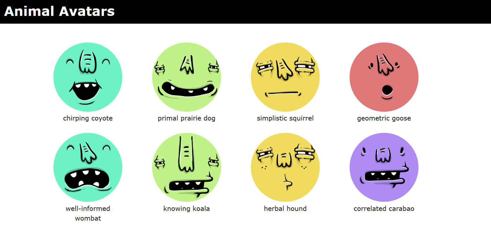

# Animal Avatars

A client-side Javascript library to generate random user avatars (Similar to Google's [Anonymous animals](https://support.google.com/docs/answer/2494888?hl=en]). Each avatar has a random name and a corresponding profile image, generated by the [Adorable Avatars API](http://avatars.adorable.io/). 

;

## Build

Run `npm run build` to generate the library file. The source file is saved to `demo/`. 

## Usage

Copy and link `demo/animal-avatars.js` to your project directory. A short demo is included under `demo/`.

### Creating a new Avatar

```Javascript
var myAvatar = new AnimalAvatars.Avatar();

// getting name and profile image
let name = myAvatar.getAvatarName();
let image = myAvatar.getAvatarUrl();
```

# License

Animal Avatars is released under the terms of the [MIT License](LICENSE).